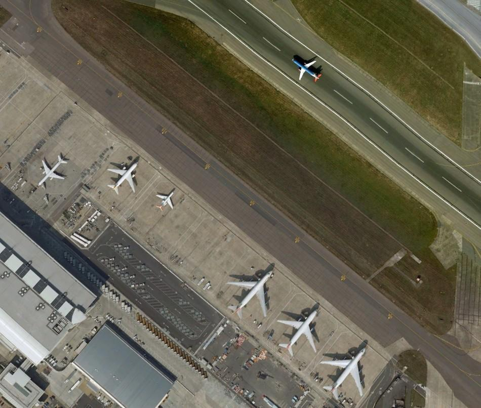
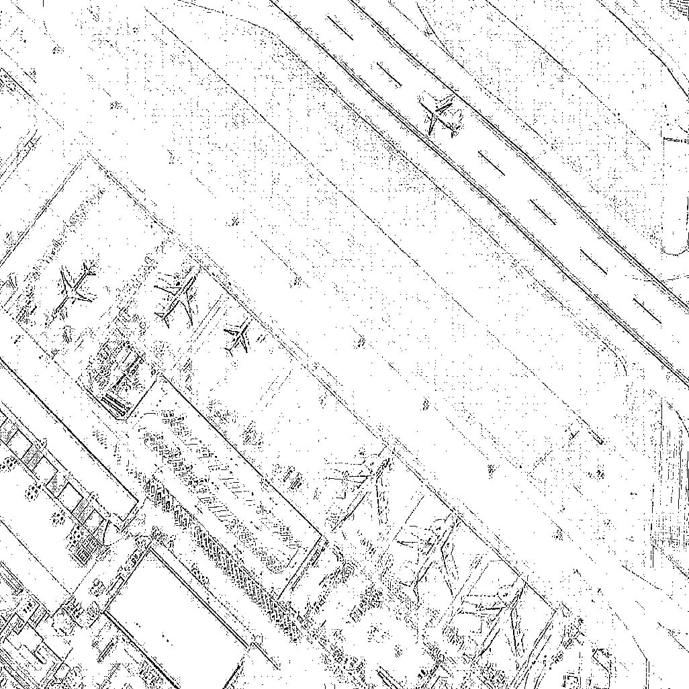

# Trabajo final de la asignatura de Aprendizaje de Máquinas

Autores: 

- Yonatan Jose Guerras Perez c-411
- Jose Miguel Perez Perez c-411

##### Agradecimientos

Los autores reconocen la colaboración de **Amanda Lucía Fuentes Ponce** por lograr un diseño magnífico de las formas utilizadas en este proyecto.

## Introducción

La elección entre una partida de corta y otra de larga duración es subjetiva entre los jugadores de videojuegos, quienes prefieren partidas de duración media con una complejidad adecuada. Los mapas juegan un papel crucial en este aspecto. En este trabajo, buscamos desarrollar un mapa para videojuegos estilo arcade utilizando técnicas de machine learning para identificar formas típicas de mapas arcade en una imagen satelital. Mediante la activación o desactivación de píxeles, eliminamos partes redundantes de la imagen que no contribuyen a un mapa jugable estilo arcade. Identificar estas formas redundantes es complicado, ya que requiere jugar varias partidas y evaluar métricas específicas, las cuales pueden variar según el tipo de juego. Las métricas utilizadas son generales y consideradas fundamentales para evaluar un buen mapa:

- Batallas decisivas, ya hablaremos mas de esto.
- Caminos simples , aumentan las posibilidades de enfrentamiento.
- Que genere puntos de avanzada , quien conquista estos puntos tiene altas probabilidades de librar a su favor una batalla.
- Caminos complicadas , estos mejoran la cobertura defensiva.

Estas métricas fueron seleccionadas debido a la importancia de tener múltiples oportunidades para recuperar la posición en caso de perder una batalla decisiva. Además, se consideraron para proporcionar oportunidades de defensa y contraofensiva, creando un equilibrio dinámico en la partida.

## Motivación

La razón detrás de abordar este tema es la alta inversión requerida para producir mapas útiles, especialmente cuando su utilidad es difícil de determinar. Sería más conveniente diseñar un mapa que cumpla con ciertas restricciones y se genere automáticamente, reduciendo significativamente los costos de producción. Este problema se clasifica como un problema de satisfacción de restricciones (CSP), cuyo costo computacional es considerable debido a la gran cantidad de variables implicadas, incluidos los píxeles que componen la imagen.

## Problemática

Nuestra tarea es transformar una imagen satelital en un mapa jugable estilo arcade, manteniendo características visuales arcade, como píxeles claros y bordes poco definidos. Aunque existen estudios sobre la generación de mapas 3D y la reconstrucción de mapas 2D a partir de imágenes satelitales, la aplicación de técnicas de machine learning para identificar formas arcade en imágenes satelitales es un área no explorada.

La esteganografía, que implica ocultar información dentro de otros mensajes o objetos para evitar su detección, es similar en algunos aspectos, pero nuestro enfoque no implica ocultar información sino identificar patrones visuales. Ejemplos de esteganografía se puede encontrar [aqui](https://infosecwriteups.com/steganography-ctfs-73f7b310b1f7?gi=9291a7cee537).

Algunos referentes sobre el tema se listan:

 - [A Robust Bio-Signal Steganography With Lost-Data Recovery Architecture Using Deep Learning](https://ieeexplore.ieee.org/document/9853601)
 - [Squint Pixel Steganography: A Novel Approach to Detect Digital Crimes and Recovery of Medical Images](https://www.igi-global.com/gateway/article/163348#pnlRecommendationForm)

Estos artículos emplean técnicas de machine learning para recuperar imágenes manipuladas mediante esteganografía, pero nuestro objetivo es identificar formas arcade en imágenes satelitales sin cifrado intencional.

## Hipótesis

- ¿Es posible modificar una imagen A en otra imagen B para detectar formas de la imagen B en A, sin añadir información a A?
- ¿Qué tan eficiente puede ser este proceso?

Nuestra hipotesis es:
 - Se puede detectar tales patrones , y se puede hacer de forma eficiente o lo que es lo mismo en tiempo polinomial.

## Objetivo general y específicos

Nuestro objetivo es convertir la imagen original en blanco y negro, activando o desactivando píxeles según la predominancia de blancos o negros. Si la imagen es predominantemente blanca, activamos píxeles; si es negra, los desactivamos. El objetivo es "agitar" la imagen hasta que se revelen formas que representen un mapa jugable y ademas que no este muy alejado de la imagen original. Necesitamos entrenar un modelo que decida cómo tratar cada píxel de la imagen de entrada.

## Propuestas de solución

#### Conversión y Normalización de Datos para Modelos de Aprendizaje Automático

En el proceso de preparación de datos para modelos de aprendizaje automático, es fundamental convertir la información en un formato que sea fácilmente interpretable por el modelo. En este estudio, se optó por simplificar la representación de las imágenes a un solo canal de color y aplicar un filtro de Laplace para resaltar los contornos.
Proceso de Normalización

La normalización de la imagen se realizó mediante el siguiente procedimiento: si el valor del píxel es mayor o igual a 128, se le asigna un valor de 1; en caso contrario, se le asigna un valor de 0. Al multiplicar esta imagen binarizada por 255, se obtiene una representación visual que se presenta a continuación:

- Antes vs. Después

#### Enfoques y Técnicas en Aprendizaje Automático

En el presente estudio, se han realizado múltiples intentos utilizando diversos enfoques y técnicas reconocidas en el campo del aprendizaje automático. En particular, se ha planteado el problema desde las siguientes perspectivas:

- Reducción de Ruido en la Imagen Original
- Transformación de una Imagen a Otra
- Interacción de un Agente en un Espacio Estático

##### Análisis de Enfoques:

Cada uno de estos enfoques será analizado en detalle, destacando sus fortalezas y debilidades, así como algunos de los resultados obtenidos durante las pruebas.

##### Limitaciones y Recursos

Es fundamental señalar que no se contaba con suficientes recursos computacionales para generar grandes conjuntos de datos de alta resolución necesarios para modelos que requieren entrenamiento supervisado. Por lo tanto, fue necesario explorar técnicas de aprendizaje que demandan un número reducido de imágenes en comparación con el aprendizaje supervisado.

### Reduccion de ruido en una imagen

`Via 1`: Auto-Encoder

En este enfoque, se considera la imagen de entrada $S$ como la suma de dos imágenes: $O$ y $E$, donde $O,E ∈M_{n,n}$ y se cumple que $S=O+E$. Aquí, hemos descompuesto $S$ en nuestra imagen de interés $O$ y un error añadido $E$. El objetivo de nuestro trabajo es minimizar $E$ tanto como sea posible.

En primer lugar empleamos un modelo de auto-enconder que está definido por los siguientes componentes:

- Dos conjuntos: el espacio de mensajes decodificados $X$; el espacio de mensajes codificados $Z$. Normalmente, $X$ y $Z$ son espacios euclidianos, es decir, $X=R_m,Z=R_n$ con $m>n$. Dos familias de funciones parametrizadas: la familia de codificadores $Eϕ :X→Z$ , parametrizada por $ϕ$; la familia de descodificadores $Dθ:Z→X$ , parametrizada por $θ$. Para cualquier $x∈X$ , normalmente escribimos $z=Eϕ(x)$, y lo llamamos código, variable latente, representación latente, vector latente, etc. Por contraste, para cualquier $z∈Z$, normalmente escribimos $x′=Dθ(z)$ , y lo llamamos mensaje (des)codificado. Generalmente, tanto el codificador como el descodificador están definidos como perceptrones multistratificados (MLPs). Por ejemplo, un codificador MLP de una capa $Eϕ$ es: $Eϕ(x)=σ(Wx+b)$ es una función de activación elemento a elemento, $W$ es una matriz de "pesos" y $b$ es un vector de "sesgo".

De acuerdo con la definición, un autoencoder recibe como entrada la imagen $S$ y produce como salida la misma imagen $S$. Además, este modelo puede ser utilizado para detectar patrones de la imagen $O$ en cualquier otra imagen, dado que el codificador comprime la imagen $O$, aprendiendo características clave para representar la imagen de salida.

`Via 2`: Multimodal

Creamos 2 imagenes con patrones interesantes a encontrar en imagenes satelitales , y las recortamos en pedazos de 100x100 , creando el conjunto $R=[ R_i | \forall R_i , R_j \in M_{100x100} ]$ , luego usamos estas imagenes para generar el ouput de un aprendizaje supervisado.

#### ¿Como generamos el ouput?

Tomamos una imagen de entrada $S$ y creamos el conjunto $K=[ S_i | \forall S_i , S_j \in M_{100x100} , i \not = j ]$ , la razón por la que escogemos tal conjunto es para no procesar tantos pedazos de la misma imagen debido al escazo poder de computo y que podamos procesar la imagen completa , luego por cada $S_i \in S$ y por cada $R_i \in R$ hacemos el proceso de minimazar la funcion $\chi (S_i , R_i )$ es decir:
  
  - $min( \chi(S_i , R_i ))$

Donde $\chi$ es el ángulo formado entre dos imagenes en el espacio de las imagenes de $M_{100x100}$ que se define como:

Sean los vectores $S_{i,j} , R_{k,j}$ que indica la fila $j$ de la matriz $S_i$ y $S_k$ respectivamente ,  entonces hacemos:

- $\chi (S_i , R_i ) = \sum$ $S_{i,j}·R_{k,j} \over|S_{i,j}||R_{k,j}|$

EL porqué escogemos esta función es porque queremos encontrar la imagen de salida que dibuje el patrón $R_k$ , y además que el patrón pueda estar algo desplazado del centro de la imagen , y aun asi ser válido. Si usaramos métricas como error medio absoluto , eliminaríamos patrones que estan en la imagen y que no son exactamente igual a $R_K$ puesto que se encuentran desplazados. 

##### Complejidad del Cálculo de Píxeles

El cálculo involucrado en este proceso es considerablemente complejo, dado que se maneja un gran número de píxeles, cada uno de los cuales puede estar activado o desactivado. Nuestra tarea consiste en activar o desactivar píxeles según la predominancia del color blanco en la imagen, de tal manera que se maximice el ángulo entre ellos.

##### Activación de Píxeles
Supongamos que la imagen es predominantemente blanca; en este caso, activamos píxeles hasta obtener una imagen que maximice el ángulo entre $S_i$ y $R_i$. Posteriormente, tomamos los píxeles negros y construimos un grafo completo entre ellos, denominado $K_p$.

##### Recorrido Hamiltoniano

Para encontrar el conjunto de píxeles que maximiza esta función, es necesario realizar un recorrido hamiltoniano en un subgrafo de $K_p$ , de tal manera que dicho camino contenga aquellos nodos que no se activan y garantice el máximo. Esto implica la necesidad de identificar tanto el subconjunto como el camino hamiltoniano, lo cual se clasifica como un problema no polinomial.

##### Aproximaciones y Resultados

Sin embargo, es posible aplicar aproximaciones que relajen el problema. Por ejemplo, podemos restringirnos a un conjunto fijo de elementos y explorar varias permutaciones de vértices para seleccionar la máxima. A pesar de estas dificultades, los resultados obtenidos no son desalentadores.

`NOTA`: Esta forma de generar dataset fue la mejor que hallamos para problemas de este tipo.

### Traduccion de una imagen en otra

Este enfoque no era muy practico puesto que el estado del arte sugiere el uso de `GAN`, el cual es una tecnica de aprendizaje supervisado y como hemos visto anteriormente , la mejor forma que teniamos para generar la imagen de salida era muy costosa. Para tener una idea de cuan costosa es, nos tomo alededor de un mes generar 100 imagenes de 100x100 por cada patron , pero para entrenar un trasformer necesitariamos una imagen completa de 800x600 o de dimensiones aproximadas, lo cual nos tomaria alrededor de 100 meses generar 100 ejemplares por cada patron , por tanto este enfoque no era viable, aunque creemos que con el computo necesario podriamos llegar a resultados satisfactorios. Otro enfoque era generar todos estos resultados manualmente, sin embargo no disponiamos de un conjuto suficientemente numeroso de integrantes por lo que a cada uno lo tocaria generar 5000 imagenes , asumiendo que queriamos encontrar hasta 100 patrones distintos en cada imagen y 100 ejemplares por cada patron. Otro enfoque pudo haber sido repartir conjuntos de imagenes de entrada en tamanos iguales por integrante , y crear un ouput a criterio , es decir, no buscar patrones especificos. Pero de igual forma esto exigia muchismos ejemplares teniendo en cuenta las estadisiticas de las dimensiones usuales de datasets para modelos como este. Por tanto concluimos que era mejor explorar otros enfoques.

### Agente interactuando en un espacio estatico 

En este enfoque usamos aprendizaje por refuerzo , consideramos un agente que aprenda a activar o desactivar pixeles segun convega a partir de una imagen de entrada.

Especficamente usamos un modelo actor-critic el cual se basa en tomar una decicio basandose en la recompenza que obtendra. Aqui nuestro meta es deducir la accion que maximiza la recompenza. Formalicemos esto.

### Componentes Clave de un Agente RL

1. **Agente**: Un sistema que realiza acciones en un entorno con el objetivo de aprender una política que maximice la recompensa acumulada.
2. **Entorno**: El mundo en el que opera el agente, que puede ser cualquier cosa desde un juego de ajedrez hasta un mercado financiero real.
3. **Estado**: Una descripción completa del entorno tal como es percibida por el agente en un momento dado.
4. **Acción**: Una elección realizada por el agente que afecta el estado del entorno.
5. **Recompensa**: Retroalimentación del entorno al agente después de realizar una acción, típicamente un valor numérico que indica cuán bueno fue el resultado de la acción.
6. **Política**: Una función que determina qué acción tomará el agente en función del estado actual.
7. **Valor de Estado**: La expectativa de recompensa futura desde un estado dado, bajo una política específica.
8. **Función de Valor-Q**: La expectativa de recompensa futura para una acción específica en un estado dado, bajo una política específica.
9. **Modelo del Entorno**: Conocimiento interno del agente sobre cómo el entorno responde a sus acciones.

### Definición Formal

Un agente de RL se puede definir formalmente como un sistema que busca maximizar la recompensa acumulada $G_t$, donde $G_t$ es la suma de recompensas $R_{t+1}, R_{t+2}, ..., R_T$ descontadas al presente, obtenidas durante un episodio que comienza en el tiempo $t$:

$G_t = R_{t+1} + \gamma R_{t+2} + \gamma^2 R_{t+3} + ... + \gamma^{T-t-1} R_T$

donde $\gamma \in [0, 1]$ es el factor de descuento que determina el valor presente de las recompensas futuras, y $T$ es el tiempo final del episodio.

### Elementos Fundamentales

- **Espacio de Estados** $S$: Conjunto de todos los estados posibles en los que puede encontrarse el entorno.
- **Espacio de Acciones** $A$: Conjunto de todas las acciones posibles que el agente puede realizar.
- **Función de Transición de Estado** $P$: Probabilidad de transición entre estados, $P_{ss'}^a = Pr\{s'|s,a\}$, la probabilidad de llegar al estado $s'$ al tomar la acción $a$ en el estado $s$.
- **Función de Recompensa** $R$: Mapea pares de estado y acción a valores esperados de recompensa inmediata, $R_s^a = E[R_{t+1 | S_t=s, A_t=a]}]$.

### Proceso de Aprendizaje

El aprendizaje se realiza a través de la interacción del agente con el entorno, que sigue un ciclo de:

1. Observar el estado actual $S_t$.
2. Seleccionar una acción $A_t$ según la política $\pi(a|s)$, que es la probabilidad de elegir la acción $a$ en el estado $s$.
3. Tomar la acción $A_t$, observar la recompensa $R_{t+1}$ y el nuevo estado $S_{t+1}$.
4. Actualizar la política y/o el valor estimado de estados y acciones basándose en la experiencia $(S_t, A_t, R_{t+1}, S_{t+1})$.

### Tipos de Problemas

- **Episódicos vs. Continuos**: Los problemas pueden ser episódicos (con inicio y fin claro) o continuos (sin un final definido).
- **Determinísticos vs. Estocásticos**: En entornos determinísticos, las transiciones de estado son predecibles; en estocásticos, son aleatorias.

En nuestro caso hemos aplicado el episódico.

### Políticas

Una política $\pi$: $S \rightarrow A$ define el comportamiento del agente, mapeando estados a acciones. El objetivo es encontrar una política óptima $\pi^*$ que maximice la recompensa esperada.

### Función de Valor

La función de valor de una política $\pi$, $v_\pi(s)$, es la recompensa esperada desde estado $s$ siguiendo $\pi$:

$v_\pi(s) = E_\pi[G_t | S_t = s]$

Donde $E_\pi$ denota la expectativa bajo la política $\pi$.

### Función Q

La función de valor acción $q_\pi(s, a)$ es la recompensa esperada de tomar acción $a$ en estado $s$ y luego seguir $\pi$:

$q_\pi(s, a) = E_\pi[G_t | S_t = s, A_t = a]$

### Aprendizaje por Refuerzo

El objetivo es encontrar $\pi^*$ tal que para todo $s$ en $S$, $v_{\pi^*(s) \geq v_\pi(s)}$ para toda política $\pi$.

### Métodos de Solución

- **Value Iteration**: Actualiza iterativamente las estimaciones de valor hasta converger a las óptimas.
- **Policy Iteration**: Mejora la política basada en la función de valor actual hasta converger a $\pi^*$.

### Algoritmos Clave

- **Q-Learning**: Aprende la función Q directamente, sin necesidad de un modelo del entorno.
- **Deep Q-Network (DQN)**: Usa redes neuronales para aproximar la función Q.
- **Actor-Critic**: Combina aprendizaje por refuerzo con críticos que evalúan acciones.

En nuestro trabajo hemos usado **DQN** en un actor **Actor-Critic**

#### Detalles de implementacion de la politica

La implementación de la política es crucial para garantizar la rápida convergencia del agente. Seleccionamos un conjunto de imágenes que esperamos encontrar y que consideramos que nos asegurarán mapas acordes con las métricas descritas. Para indicar al agente cuán cerca está de generar la imagen objetivo, llevamos ambas imágenes a un espacio común y calculamos el ángulo entre la imagen, luego calculamos el ángulo comprendido entre ambas imágenes. Cuanto mayor sea el ángulo, más similares son las imágenes.

Nota: Este método presenta claramente problemas de eficiencia. Dado que se requieren múltiples imágenes para describir las líneas que se buscan en la imagen objetivo, y por ende, se debe seleccionar un gran número de imágenes para encontrar similitudes, esto resulta en costos computacionales significativos.

Si la acción seleccionada por el agente incrementa la mayor recompensa recibida en el episodio, entonces esa acción es ejecutada. La justificación detrás de esta idea se fundamenta en los siguientes argumentos:

Si al realizar una acción nos alejamos de la solución, entonces debemos revertir dicha acción y ejecutar la esperada. Evitamos actuar en el medio para no contaminar el nuevo estado, y así evitar generar más errores en la siguiente acción.

Al ajustar la máxima recompensa, es crucial considerar un aspecto importante: si para completar una tarea se espera que el agente realice un conjunto de acciones, digamos $a_0,a_1,...,a_k$ , las recompensas se otorgan en orden no decreciente y además, el orden de las acciones no importa. Sin embargo, durante el proceso de entrenamiento, puede suceder que el agente realice $a_i$ y luego no pueda realizar $a_{i−1}$ , lo que deriva en tiempos de convergencia más prolongados.

### Psceudocodigo

1. Inicializar arbitrariamente $Q(s, a)$ para todos $s \in S$, $a \in A$ , $best=0$ .
2. Repetir hasta convergencia:
   - Seleccionar $A_t$ usando política derivada de \(Q\) (por ejemplo, $\epsilon$-greedy).
   - Tomar acción $A_t$, observar $R_{t+1}, S_{t+1}$.
   - If $best < R_{t+1}$:
     -   Aplicar accion en el medio
     -   $best=R_{t+1}$
   - Actualizar $Q(S_t, A_t)$ basado en $R_{t+1}$ y $max_a Q(S_{t+1}, a)$.

Nota:
- El espacio visible por el agente es una matriz de 100x100 y se pueden activar o desactivar pixeles , por tanto tenemos un total de $20000$ acciones
- Por cada episodio desplazamos la ventana de vision del agente tal que el agente logre conectar puntos del episodio anterior con puntos del nuevo episodio

Este agente estuvo entrenando por 15 dias sin embargo no optuvimos resultado alguno, creemos que esto se debe a que no encontramos una arquitectura neural que haga al agente explorar de forma mas rapida o que falto epocas de entrenamiento. En cualquier caso estaba mas alla de nuestras limitaciones.

## Experimentación y resultados

De todos los enfoques que hemos probado , solo en uno vale la pena hacer enfasis , puesto que mostro claros resultados favorables, aunque los demas tambien seran expuestos.

### Notas sobre el computo disponible:

Disponiamos de una memoria RAM de 16 GB de 4800 M/T (DDR5) y un microprocesador i7-1355U

### Agente interactuando en un espacio estatico

Utilizamos una estrategia común en este enfoque, que consiste en generar acciones de forma aleatoria y entrenar el modelo en función de tales decisiones, hasta alcanzar un punto en el que el modelo pueda comenzar a tomar decisiones por sí mismo. La razón detrás de este enfoque se basa en la observación práctica de que, a menudo, el modelo no es capaz de explorar adecuadamente el espacio de soluciones en las primeras etapas del entrenamiento. Por lo tanto, es necesario forzarlo a hacerlo.

#### Observaciones Durante el Entrenamiento

En nuestro caso, sin esta heurística, observamos que el modelo podía pasar largas horas en proceso de aprendizaje sin mostrar avances significativos, como si se limitara a tomar una única decisión. A pesar de variar el ritmo de aprendizaje y el look-ahead del modelo, los cambios en el rendimiento eran mínimos. Sin embargo, notamos que al modificar la imagen de entrada, el modelo se esforzaba por tomar decisiones diferentes.

Este enfoque produjo resultados limitados, generando imágenes que variaban desde representaciones monótonas hasta imágenes de un único color, ya sea blanco o negro. En algunos casos, se observó que el modelo modificaba la imagen original al introducir algún píxel negro. Sin embargo, el modelo no cumplió con las restricciones definidas en las políticas de recompensa, como la necesidad de respetar la predominancia del color. Además, no logró crear patrones interesantes; por ejemplo, las imágenes resultantes presentaban un punto en el centro de cad 100×100.

#### Desempeño del Modelo

Durante la etapa de entrenamiento, el modelo mostró una disminución mínima en la función de pérdida, a pesar de haber sido entrenado durante 15 días en Google Colab. Esto sugiere que el enfoque actual no es efectivo para lograr los objetivos deseados y requiere una revisión y optimización para mejorar su rendimiento y adherencia a las políticas establecidas.

### Reduccion de ruido en la imagen original

#### Auto-encoder resultados:

El modelo de autoencoder generaba salidas constantes que variaban entre una imagen completamente negra, una imagen completamente blanca, o la misma imagen de entrada. Aunque el último resultado parecía alentador, en realidad indicaba que el modelo se comportaba como una función identidad. Se realizaron pruebas con varios conjuntos de datos.

##### Análisis de los Datos Iniciales

Las imágenes iniciales utilizadas eran generadas y compartían una propiedad común: el histograma de escalas de grises mostraba que el 76% de los píxeles tenían un valor de 255 (blanco). La función de pérdida del modelo se situaba en 0.24, lo que, sumado a la predominancia de imágenes en blanco, llevó a la conclusión errónea de que el modelo estaba funcionando adecuadamente debido a esta característica.

Al cambiar el conjunto de datos por imágenes reales, solo se obtuvo la misma imagen de entrada como salida. Esto sugiere que podían ocurrir dos situaciones: o bien la arquitectura del modelo era incorrecta, o faltaba entrenamiento. Sin embargo, a pesar de entrenar el modelo durante 1000 épocas, los resultados continuaron siendo los mismos.

#### Limitaciones Arquitectónicas

Se limitaron las arquitecturas utilizables, ya que aumentar el número de neuronas incrementa el tamaño del modelo y exige más recursos computacionales. De todas las arquitecturas probadas que podían ser alojadas en la memoria RAM, ninguna produjo resultados diferentes.

#### Intentos Adicionales y Nuevas Estrategias

Se intentó utilizar Google Colab para variar las arquitecturas y la cantidad de entrenamiento, pero este enfoque tampoco arrojó resultados distintos. Por lo tanto, se consideró necesario explorar un nuevo enfoque de aprendizaje.

### Mulimodal resultados:

#### El modelo empleado

  - Layer (type)                Output Shape              Param #

  - input_1 (InputLayer)        [(None, 100, 100, 1)]     0

  - dropout (Dropout)           (None, 100, 100, 1)       0

  - conv2d (Conv2D)             (None, 93, 93, 32)        2080

  - flatten (Flatten)           (None, 276768)            0

  - dense (Dense)               (None, 10)                2767690

  - dense_1 (Dense)             (None, 10)                110

  - dense_2 (Dense)             (None, 10000)             110000

##### Resultados Experimentales en la Generación de Salidas

Experimentalmente, se comprobó que generar la salida de esta forma y posteriormente convertirla en una matriz de 
100×100 proporcionaba mejores resultados.

##### Función de Activación

La función de activación utilizada fue la lineal, ya que otras funciones de activación típicas en el procesamiento de imágenes, como ReLU y Softmax, producían salidas constantes en alguna capa, lo que resultaba en un resultado final también constante.
Modelo y Comparación
Se creó un modelo $M_p$ con esta arquitectura para cada patrón R$_k$, el cual mostró un rendimiento notable. Para cada fragmento $S_i$ de la imagen original, se hizo pasar $S_i$ a través de cada modelo $M_p$ y se compararon los resultados utilizando la siguiente métrica:

Minimizar el error medio absoluto entre la salida del modelo $M_p$ y $S_i$. En contraste con la vía 1 de solución, se buscaba que la salida fuera similar a la imagen original, es decir,encontrar un patrón $O$ que mantuviera una relación con la imagen original.

Los resultados de esta via fueron bastante diferentes y buenos en general , abajo listamos algunas de las curvas de aprendizaje de los modelos empleados para reconocer algunos patrones.

En estos gráficos se puede apreciar que las curvas de los modelos convergen en el mismo punto a partir de la época 20. Aquí la condición de parada de entrenamineto de cada modelo fue un épsilon ajustado experimentalmente de la pérdida promedio en la fase de validación, tal épsilon es $5·1e$-$3$ , para épsilon más bajos el modelo no parecía converger , puesto que pasaba de las 200 épocas

En la ruta `gallery` hay un total de 150 pares input , ouput de las pruebas utilizadas con esta vía, y como dicho antes, el mejor resultado obtenido.

La razón por la cual hay una línea que no parece pertenecer a la imagen original en la imagen de salida se debe a la resolución de la imagen, que es de 1026×1026 píxeles. Durante el procesamiento, se tomaron ventanas contiguas de 100×100 píxeles, tanto de izquierda a derecha como de arriba hacia abajo.

#### Problema de Recorte

Este método de extracción de ventanas deja un área residual no procesada: un segmento de 26×1026 píxeles en el caso de la columna más a la derecha y un segmento de 1026×26 píxeles en el caso de la fila más inferior. Esta área adicional es responsable de la aparición de líneas o bordes en la imagen de salida que no corresponden a la imagen original.

## Discusión de los resultados

Consideramos que la principal razón por la que obtuvimos resultados desfavorables con el enfoque de aprendizaje por refuerzo y el enfoque de autoencoder se debe a la falta de una arquitectura que redujera los tiempos de convergencia de cada modelo.

#### Resultados del Enfoque Multimodal

Los resultados del enfoque multimodal son, en términos generales, interesantes; sin embargo, presentan oportunidades de mejora. Se puede observar la presencia de ruido y que hay partes de la imagen que no están completamente relacionadas entre sí. Además, la imagen resultante no guarda una relación significativa con la imagen original, ya que se elimina mucha información útil que debería prevalecer, como es el caso del primer ejemplo expuesto.
Sería beneficioso mantener las curvas principales que son esenciales para la imagen y que además proporcionan mapas jugables. De manera similar, en la segunda imagen, el resultado elimina numerosas partes de la imagen sin concretar ningún patrón. A pesar de esto, consideramos que, en términos generales, los resultados son positivos porque generan mapas jugables diversos, aunque no siempre cumplen con la premisa de ofrecer un estilo arcade ni mantienen concordancia con la imagen original.

#### Tiempos de Generación

En cuanto a los tiempos de generación, observamos que son elevados para una computadora promedio, consumiendo hasta 4.5 GB de RAM. Esto se debe a que es necesario comparar cada imagen de
100×100 en la imagen original con las salidas de cada modelo. Este proceso podría ser optimizado mediante un clasificador que aproximara cuál modelo sería el más conveniente dada una imagen de entrada. Sin embargo, dicho clasificador no pudo ser implementado de manera satisfactoria, ya que la tasa de aciertos por cada época de entrenamiento no superó el 50%.
Al ser probado y evaluado con todas las imágenes disponibles en la ruta ./dataset_black_white/val, los resultados obtenidos fueron insatisfactorios; las salidas eran muy discordantes con respecto a la imagen original y no ofrecían formas interesantes, generando un alto nivel de ruido. Por tanto, concluimos que la mejor opción fue el método determinista.

## Repercusión ética de las soluciones.

El impacto ético que puede tener el reconocimiento de patrones en imágenes es considerable si analizamos los usos que puede llegar a tener trabajos como este.

- Localización de imágenes obscenas dentro de imágenes.
- Generación de imágenes para fines propagandísticos.
- Modificación de imágenes, alterando su estructura original para transmitir mensajes subliminares.

Los últimos dos puntos son posibles dado que se pueden realizar acciones que agreguen información sobre la imagen.

## Conclusiones y trabajo futuro

Anteriormente, planteamos las siguientes preguntas de investigación:
¿Es posible modificar una imagen A en otra imagen B para detectar formas de la imagen B en A, sin añadir información a A?
¿Qué tan eficiente puede ser este proceso?
Resultados
Hemos demostrado que, efectivamente, es posible detectar tales formas. Sin embargo, la complejidad del método multimodal aumenta linealmente a medida que incrementa la cantidad de patrones a detectar. Supongamos que tenemos p patrones y la imagen se divide en k submatrices; entonces, el número total de chequeos de verificación para determinar qué modelo aplicar en cada submatriz $S_i$ es $p⋅k$.Si reducimos el tamaño de cada submatriz $S_i$ a un cuarto de su tamaño original, entonces el número total de chequeos se convierte en $4⋅k⋅p$. Generalizando, la cantidad total de chequeos $T$ puede expresarse como: $T≤H⋅W⋅p$ donde $H$ y $W$ representan la altura y el ancho de la imagen, respectivamente. Por lo tanto, $T$ está acotado por una expresión polinómica. Sin embargo, este resultado no proporciona información sobre los tiempos de generación de los datasets, que representan la operación más compleja a la que nos enfrentamos, ya que generar los datasets no es una tarea eficiente.

#### Trabajo Futuro

Como trabajo futuro, podemos proponernos desarrollar un método más eficiente para la selección de modelos. Aunque el método determinista sea polinómico, sigue siendo relativamente lento considerando las dimensiones que una imagen puede tener, llegando hasta 8K o más. Por lo tanto, es imprescindible aproximar este selector con un modelo que pueda determinar cuál es el modelo más probable de ofrecer buenos resultados.
Además, es igualmente importante mejorar las heurísticas para generar datasets más complejos, dado que las imágenes generadas no explotan completamente la potencia descriptiva que posee la métrica utilizada para computar similitudes entre imágenes.

## Bibliografía

- [HIGH-DIMENSIONAL CONTINUOUS CONTROL USING
GENERALIZED ADVANTAGE ESTIMATION](https://arxiv.org/pdf/1506.02438)
- [Deep Q-Learning for Atari Breakout](https://keras.io/examples/rl/deep_q_network_breakout/)
- [Actor Critic Method](https://keras.io/examples/rl/actor_critic_cartpole/)
- [OpenAI Spinning Up](https://spinningup.openai.com/en/latest/user/introduction.html)
- [Deep Deterministic Policy Gradient](https://keras.io/examples/rl/ddpg_pendulum/)
- [Generative Adversarial Nets](https://arxiv.org/pdf/1406.2661)
